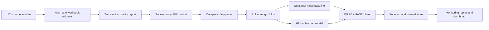

# Retail Demand Forecasting & Monitoring

An evidence-first machine-learning project for forecasting daily product demand from real retail
transactions. The system is being built around chronological backtesting, strong seasonal
baselines and post-forecast monitoring rather than a single favorable metric.

> **Status:** local M1 verified. A frozen learned candidate improved aggregate error but was
> rejected for bias and insufficient SKU breadth. Seasonal naive remains champion; the final
> holdout is still reserved and no public demo is claimed yet.

## Problem

For a fixed cohort of retail products, forecast the next 14 days of positive observed invoiced
unit sales. These sales are used as a demand proxy; the dataset contains no stock availability,
lost-sales or fulfilment evidence. The
cohort is selected only from an initial training window, and every evaluation fold predicts dates
strictly after its training cutoff.

This is an educational forecasting system. The source is a historical UK online-retail dataset,
not a live store feed, and the output is not validated for inventory or purchasing decisions.

## Why this project exists

The existing Machine Failure Risk Classifier demonstrates tabular classification, reproducible
training, a strict API and deployment. This project is intentionally different:

- real transactional data rather than a synthetic table;
- temporal validation rather than a random or stratified split;
- multi-horizon regression rather than classification;
- seasonal baselines, forecast bias and interval coverage;
- batch prediction and monitoring replay;
- SQL-backed forecast and outcome history in a later milestone.

## Data

The project uses [UCI Online Retail II](https://doi.org/10.24432/C5CG6D), a workbook containing
1,067,371 physical rows from a UK non-store retailer between December 2009 and December 2011.
UCI publishes it under CC BY 4.0. Its two sheets overlap from 1–9 December 2010; a documented
multiset union removes 22,523 repeated cross-sheet copies and retains 1,044,848 logical rows. The
raw workbook is downloaded separately and is never committed to this repository.

The target is **gross positive invoiced units per SKU and calendar day**. Cancellation invoices,
returns, non-positive prices and non-product stock codes do not enter the target. They remain
accounted for in data-quality reporting so that cleaning decisions are visible. A source-wide
activity flag distinguishes days with no eligible SKU sale from dates with no transaction anywhere
in the supplied ledger.

See [the data contract](docs/DATA_CONTRACT.md) and
[the evaluation protocol](docs/EVALUATION_PROTOCOL.md) before interpreting metrics. The observed
M0 evidence is summarized in [the data audit](docs/DATA_AUDIT.md) and
[the baseline report](reports/m0/M0_REPORT.md).

## Observed M1 result

A global direct `HistGradientBoostingRegressor` was selected on 14 tuning folds and confirmed once
on six later folds. It reduced confirmation WAPE from `1.2365` to `1.0889` and MASE from `0.6843`
to `0.6043`, but overpredicted by `14.77 %` and improved only 10 of 20 SKU. The predeclared gate
therefore rejected it; a lower aggregate error alone was not enough to replace the baseline.

See the complete [M1 decision report](reports/m1/M1_REPORT.md) and its compact, hashed evidence.
The final 84-day holdout remains untouched.

## Planned architecture



## Local setup

Python 3.12 is required.

```powershell
py -3.12 -m venv .venv
.\.venv\Scripts\python.exe -m pip install --upgrade pip
.\.venv\Scripts\python.exe -m pip install -c requirements\constraints-py312.txt -e ".[dev]"
.\.venv\Scripts\retail-forecast.exe --help
```

The verified M0 commands are:

```powershell
retail-forecast download
retail-forecast prepare
retail-forecast baseline
```

The M1 workflow deliberately separates selection from confirmation:

```powershell
retail-forecast tune-model
retail-forecast validate-model --selection <generated-selection.json>
```

`validate-model` creates a panel-keyed claim and receipt so changing `--report-dir` cannot silently
repeat the confirmation. A failed or interrupted claim must be inspected rather than deleted and
rerun casually.

Raw and generated data remain under ignored `data/` and `reports/generated/` directories.

## Quality gate before publication

The project will not be presented as complete until it has:

1. a checksum-pinned source and reproducible daily panel;
2. at least six rolling-origin folds with no future leakage;
3. a seasonal-naive baseline reported before model selection, a frozen development confirmation,
   and a single baseline-versus-challenger comparison when the final window is opened;
4. consistent improvement across folds and products, not only in aggregate;
5. interval coverage and failure cases shown in the demo;
6. automated tests, a model card and a local functional demo.

Deployment, PostgreSQL and portfolio integration come only after that gate.

## Author

Cristóbal Vergara — [GitHub](https://github.com/xSkyLiN3) ·
[LinkedIn](https://www.linkedin.com/in/cristobal-vergarav/)
