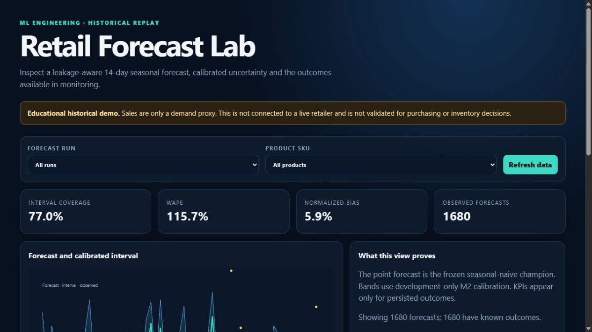
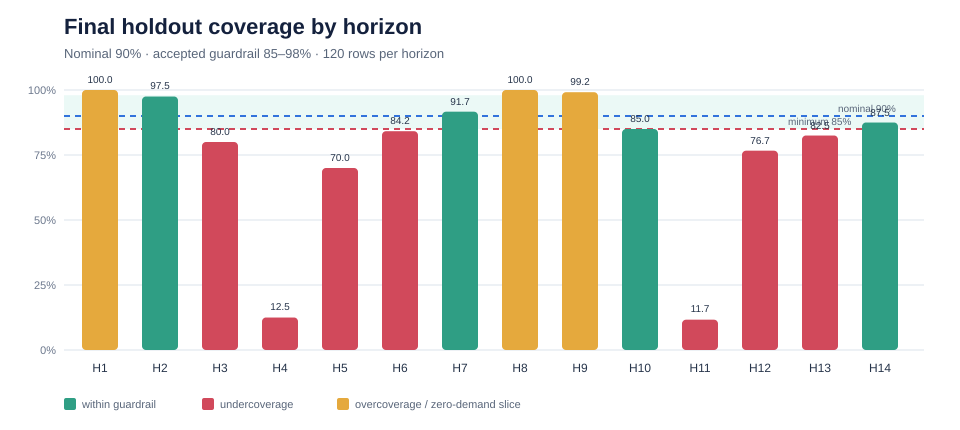

# Retail Demand Forecasting & Monitoring

An end-to-end ML engineering case study built from real retail transactions: reproducible data
preparation, chronological backtesting, model-governance gates, calibrated forecast intervals,
batch inference, outcome reconciliation, PostgreSQL/JSON persistence, a read-only API and an
interactive monitoring dashboard.

> **Final status:** the software and evidence pipeline are complete, but the model is **not approved
> for operational purchasing decisions**. The frozen final holdout exposed 77.02% interval coverage
> against a 90% nominal target and an 85% minimum guardrail. That failure is published, not tuned
> away. The project is a historical educational demonstration of responsible ML evaluation.



## What this project demonstrates

- source and workbook integrity pinned with SHA-256;
- a training-only SKU cohort and documented daily-demand contract;
- 20 non-overlapping rolling-origin development folds plus one separately claimed 84-day holdout;
- comparison of a strong weekly baseline with a global learned challenger;
- promotion rules that consider error, bias, fold consistency and SKU breadth;
- signed, horizon-specific prediction intervals calibrated without holdout outcomes;
- prequential monitoring with coverage, width, Winkler score, WAPE and normalized bias;
- deterministic, idempotent batch forecasts and strict outcome reconciliation;
- interchangeable atomic JSON and PostgreSQL repositories;
- FastAPI endpoints and a dependency-free responsive dashboard;
- Python 3.12 packaging, tests, lint, CI, Dockerfile and localhost-only Compose exposure.

## Final evidence

The learned `poisson_conservative` challenger reduced confirmation WAPE by 11.94%, from `1.2365`
to `1.0889`, but was rejected because its absolute bias reached 14.77% and it improved only 10 of
20 products. The deterministic `seasonal_naive_7d` baseline therefore remained champion.

M2 then froze interval calibration and monitoring policy before opening the final window exactly
once.

| Final holdout metric | Observed | Predeclared reading |
|---|---:|---|
| Rows | 1,680 | 20 SKU × 14 horizons × 6 origins |
| WAPE | 1.1565 | below the provisional 2.00 alert threshold, but still weak |
| MAE | 85.1881 | units per SKU-day forecast row |
| Normalized bias | +0.0593 | passes the ±0.10 guardrail |
| Empirical coverage | **77.02%** | **fails** the 85% minimum and 90% nominal target |
| Mean interval width | 192.3692 | must be read together with coverage |
| Winkler score | 1,105.4818 | penalizes misses and width |

The outcome is `degraded_with_published_alerts`: 52 alerts were emitted across the overall,
horizon and SKU scopes. This is a useful no-go result, not evidence of a production-ready demand
model. See the [M2 report](reports/m2/M2_REPORT.md), [model card](MODEL_CARD.md) and
[compact evidence summary](reports/m2/evidence/evaluation_summary.json).



## Architecture


The detailed design is in [Architecture](docs/ARCHITECTURE.md). The target definition and temporal
rules live in the [data contract](docs/DATA_CONTRACT.md) and
[evaluation protocol](docs/EVALUATION_PROTOCOL.md).

## Run the reviewed demo

Python 3.12 is required.

```powershell
py -3.12 -m venv .venv
.\.venv\Scripts\python.exe -m pip install --upgrade "pip==26.2.1"
.\.venv\Scripts\python.exe -m pip install `
  --constraint requirements\constraints-py312.txt `
  --editable ".[api,postgres,dev]"
.\.venv\Scripts\retail-forecast-api.exe
```

Open `http://127.0.0.1:8000`. The bundled snapshot is a read-only historical replay. API
documentation is available at `http://127.0.0.1:8000/docs`.

For PostgreSQL-backed local execution:

```powershell
$env:POSTGRES_PASSWORD = "replace-with-a-local-secret"
docker compose up --build
```

Compose publishes only the API on `127.0.0.1`; PostgreSQL has no host port. Use a real secret and a
TLS reverse proxy before any VPS deployment. Full operating instructions are in
[Operations](docs/OPERATIONS.md).

## Reproduce the evidence

```powershell
retail-forecast download
retail-forecast prepare
retail-forecast baseline
retail-forecast tune-model
retail-forecast validate-model --selection <frozen-selection.json>
retail-forecast freeze-m2
retail-forecast evaluate-holdout --contract <frozen-m2-contract.json>
```

The last command is intentionally separate and panel-keyed by an exclusive claim/receipt. It must
not be scheduled in CI or repeated after outcomes have been observed. Batch inference also verifies
the panel, cohort, M1 evidence, M2 contract and source-tree hashes before opening storage.

Raw UCI files, processed panels, local claims/receipts and generated scratch runs are ignored. The
reviewed reports and their output hashes remain versioned.

## Quality

The reviewed release passed:

- 103 tests on Python 3.12;
- Ruff lint and format checks over 50 files;
- wheel and source-distribution builds in a clean temporary workspace;
- FastAPI health/dashboard smoke tests;
- integrity tests for tampered contracts, panels, receipts and output manifests.

CI runs on Windows and Linux. Docker packaging is included; the final audit host did not have a
Docker daemon, so image construction must still be confirmed on a Docker-enabled machine before
deployment.

## Data and limitations

The source is [UCI Online Retail II](https://doi.org/10.24432/C5CG6D), licensed CC BY 4.0. It
contains historical invoices from a UK non-store retailer. The target is gross positive invoiced
units—not unconstrained demand. There is no reliable inventory, stockout, fulfilment, promotion or
lost-sales context.

High WAPE, undercoverage and unstable SKU slices show that the current champion is unsuitable for
business decisions. Any improved interval method or model must be evaluated as a new version on new
untouched temporal evidence; the published holdout cannot be reused as a tuning set.

## Author

Cristóbal Vergara — [GitHub](https://github.com/xSkyLiN3) ·
[LinkedIn](https://www.linkedin.com/in/cristobal-vergarav/)

Code license: [MIT](LICENSE).
