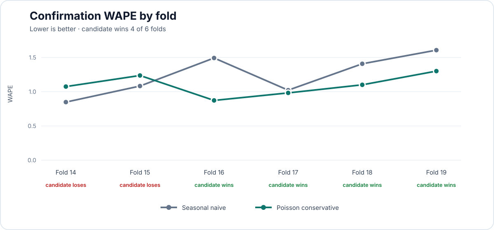

# M1 — Modelo global y decisión de promoción

## Resultado

El modelo global `poisson_conservative` **no fue promovido**. Aunque redujo el WAPE de
confirmación de `1.2365` a `1.0889` (mejora relativa de `11.94 %`) y también mejoró MASE, falló
tres criterios predeclarados: bias absoluto, deterioro de bias frente al baseline y amplitud de la
mejora por SKU. `seasonal_naive_7d` conserva el rol de champion.

No se realizó retuning después de observar la confirmación y los últimos 84 días continúan
reservados, sin predicciones ni métricas.

## Diseño congelado antes de confirmar

- Modelo global directo en formato largo: una fila por origen, SKU y horizonte.
- Horizonte: 14 días, todos predichos desde el mismo cutoff.
- Features causales con 56 días de historia; cada label de entrenamiento cumple
  `target_date <= cutoff`.
- Tres configuraciones fijas de `HistGradientBoostingRegressor`.
- `early_stopping=False`, 250 iteraciones y semilla 42 en todos los candidatos.
- Folds `0-13` para selección; folds `14-19` para una única confirmación.
- Gate de confirmación persistido antes de leer sus resultados.

El contrato exacto de variables está en
[feature_contract.json](evidence/feature_contract.json) y la búsqueda completa en
[model_grid.json](evidence/model_grid.json).

## Selección en folds 0–13

| Modelo | WAPE | Mejora vs. baseline | MASE | Bias | Folds ganados |
|---|---:|---:|---:|---:|---:|
| Seasonal naive | 1.4250 | — | 0.6859 | +0.1294 | — |
| Poisson conservador | **1.2196** | **14.42 %** | **0.6290** | +0.2206 | 11/14 |
| Poisson medio | 1.2993 | 8.82 % | 0.6761 | +0.2565 | 12/14 |
| Squared error control | 1.4164 | 0.60 % | 0.7363 | +0.4237 | 7/14 |

La regla primaria era el WAPE agregado; por eso se seleccionó Poisson conservador. El bias de
tuning ya mostraba un riesgo, pero no era una licencia para cambiar el criterio después de ver los
resultados. La selección inmutable quedó registrada como `88eb90b8563a7568`, con SHA-256
`4988769d144732e3c8154f310ab989670dc6abe3e423bec3a19e503796119856`.

## Confirmación en folds 14–19

| Métrica | Candidato | Baseline | Resultado |
|---|---:|---:|---|
| WAPE | **1.0889** | 1.2365 | mejora 11.94 % |
| MASE | **0.6043** | 0.6843 | mejora |
| MAE | **62.23** | 70.67 | mejora |
| Bias normalizado | +0.1477 | **−0.0103** | candidato sobrepronostica |
| Unidades predichas | 110,205.4 | 95,030.0 | actual: 96,020 |
| Folds con menor WAPE | 4/6 | 2/6 | pasa mínimo |
| SKU con menor WAPE | 10/20 | — | no alcanza 11 |

La mejora apareció en ambos tramos: `13.05 %` para horizontes 1–7 y `10.89 %` para horizontes
8–14. No depende únicamente de los primeros días del forecast.

### Gate predeclarado

| Criterio | Umbral | Observado | Pasa |
|---|---:|---:|:---:|
| Mejora relativa de WAPE | ≥ 5 % | 11.94 % | sí |
| Folds ganados | ≥ 4/6 | 4/6 | sí |
| SKU ganados | ≥ 11/20 | 10/20 | **no** |
| MASE inferior al baseline | < 0.6843 | 0.6043 | sí |
| Bias absoluto | ≤ 0.10 | 0.1477 | **no** |
| Deterioro absoluto de bias | ≤ 0.02 | 0.1374 | **no** |
| Predicciones finitas y no negativas | obligatorio | sí | sí |

El SKU `84270` tuvo demanda real agregada igual a cero durante la confirmación, por lo que su WAPE
es no evaluable y no cuenta como victoria. Entre los SKU evaluables, el candidato ganó en 10 y
perdió en 9. La decisión no se modifica reinterpretando ese caso después de observarlo.

## Lectura del fallo

El candidato aprende suficiente estructura para reducir error absoluto, pero desplaza el volumen
total hacia arriba: pronostica 14,185 unidades más que las observadas. El patrón es coherente con
una pérdida Poisson de enlace logarítmico, que produce valores positivos incluso para combinaciones
con demanda histórica casi nula. Es una hipótesis explicativa, no una causalidad demostrada.

Los horizontes 4 y 11 tuvieron cero unidades reales agregadas. El baseline semanal predijo cero y
el candidato produjo un MAE pequeño pero no nulo (`0.247` y `0.255`). Esto revela una regularidad
del ledger —no actividad dominical en esos bloques— que el baseline captura de forma natural. Los
deterioros mayores se concentran en algunos SKU de bajo volumen, especialmente `84347` y `21982`,
mientras las mejoras más fuertes aparecen en `84992`, `85099B` y `21977`.

## Controles de ingeniería

- 20 SKU × 14 horizontes completos en cada fold.
- 14/14 ajustes de tuning y 6/6 de confirmación usaron como última etiqueta exactamente su cutoff.
- Cero predicciones raw negativas en Poisson.
- Mutar outcomes posteriores al cutoff no cambia features ni forecasts del origen.
- Comparación pareada exacta por fold, cutoff, fecha, SKU y horizonte.
- Contratos, inputs, entorno, código y outputs protegidos con SHA-256.
- Un recibo por hash de panel bloquea otra confirmación accidental con un `report-dir` distinto.
- La decisión se reconcilia con el archivo de comparación; no se confía en una bandera aislada.

La ejecución de confirmación es `de2cb9a17c8762ec`. Las tablas completas de predicciones se
mantienen fuera del repositorio por tamaño; sus hashes y el resumen verificable están en
[confirmation_summary.json](evidence/confirmation_summary.json). La selección queda resumida en
[tuning_summary.json](evidence/tuning_summary.json).

## Decisión y siguiente hito

No se abrirá el holdout para este candidato ni se probarán correcciones usando los folds ya vistos.
M2 debe construir incertidumbre y monitorización alrededor del champion estacional, incluida
cobertura por horizonte, detección de bias y tratamiento explícito de ventanas con demanda cero.
Solo después de congelar ese protocolo tendría sentido evaluar una vez los 84 días finales.

Este resultado no demuestra impacto comercial ni superioridad general de Poisson. Sí demuestra una
decisión de ML Engineering defendible: un modelo con mejor métrica agregada fue rechazado porque su
sesgo y su cobertura por producto no cumplían el estándar definido antes de evaluarlo.
